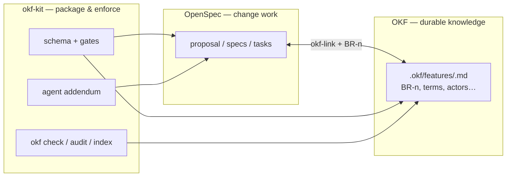
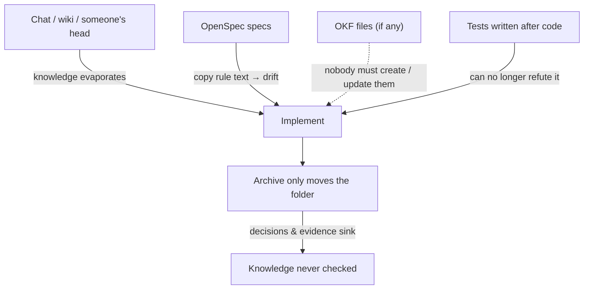
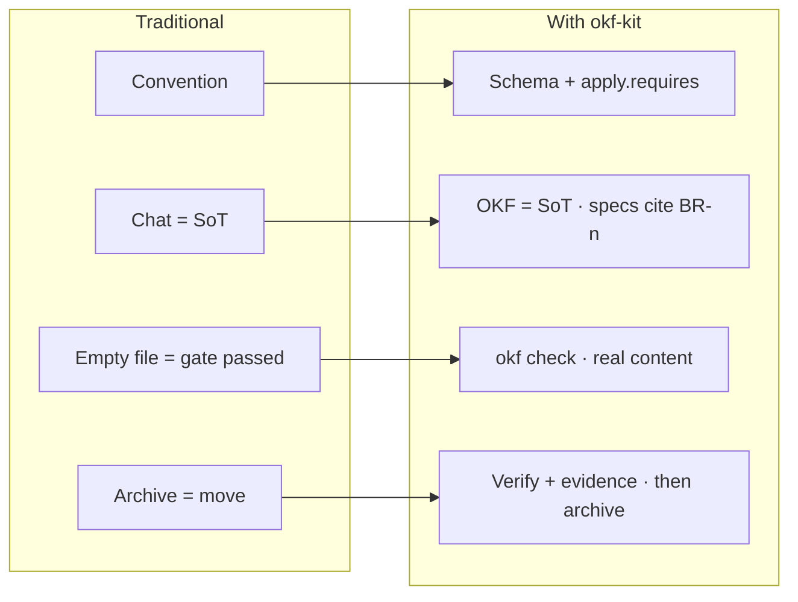
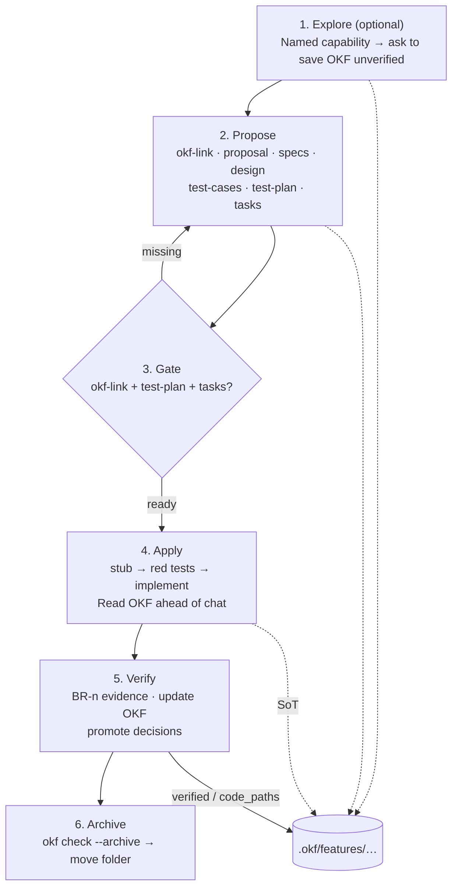

# okf-kit — Team Overview

What **okf-kit delivers**, which **limitations it closes** compared with using
OpenSpec and OKF the traditional way, and the **workflow for implementing a
task**. Mechanics live in
[`openspec-okf-workflow.md`](./openspec-okf-workflow.md).

---

## 1. Three layers, one workflow



| Layer | Role |
| --- | --- |
| **OpenSpec** | Carries *work for one change*: proposal, specs, design, tasks |
| **OKF** | Carries *domain knowledge that outlives every change*: terms, `BR-n`, actors, permissions… |
| **okf-kit** | Packages how those two layers stay joined: gated schema, validator, templates, agent guidance — install once, upgradeable |

Without the kit, the team remembers “create OKF”, “test first”, “verify before archive”. With the kit, gates + `okf check` turn most of that into mechanical constraints.

---

## 2. What the traditional approach misses

Using OpenSpec and OKF separately (or only one of them) usually looks like this:



| Limitation | Consequence |
| --- | --- |
| Domain knowledge lives in chat or is copied into specs | Duplicate / drifted rules; no stable `BR-n` |
| OKF is not wired into the change lifecycle | Agents skip entries; implement reads the wrong source |
| No gate before `apply` | Coding starts without OKF / test-plan |
| Test-first is only convention | Post-hoc tests are shaped by the code and rarely refute it |
| Verify / archive do not check content | Archive leaves `unverified` entries with no `file:line` evidence |
| Guidance lives in OpenSpec skill files | `openspec update` overwrites them → custom OKF behavior is lost |
| Each repo hand-copies schema / checklists | Drift across projects; hard to upgrade in lockstep |

---

## 3. What okf-kit closes



1. **One source of truth for rules** — Rules live in `.okf/features/`; specs only `Implements: BR-n`, never copy the text.
2. **Two hard gates before implement** — `okf-link` (entry exists) + `test-plan` + `tasks` must be present.
3. **Test-first with a vocabulary** — `planned → skeleton → failing → passing`; unit tests must be `failing` before logic; every test records its *falsifier*.
4. **Verify required before archive** — Rule Evidence (`file:line`), update `verified` / `pending_changes`, promote decisions from `design.md` into `.okf/decisions/`.
5. **Tooling-agnostic validator** — `okf check` / `--archive` behave the same under Claude, Codex, Cursor, a terminal, and CI.
6. **Survives `openspec update`** — OKF behavior lives in the schema + the `<!-- okf-kit -->` block in `CLAUDE.md` / `AGENTS.md`, not in hand-edited OpenSpec skills.
7. **Install / upgrade as a kit** — `okf init` / `okf upgrade`; different projects share one workflow.

What the kit **does not** do (still needs human review): whether a rule is worded well, whether cited evidence actually proves the rule, whether an agent recorded honestly. See *Known limitations* in the workflow doc.

---

## 4. Lifecycle of a change (high level)



**When a rule is wrong:** OKF → spec → test-plan / test → code — never let the code redefine the domain.

**When OKF and code disagree:**

| Verdict | Action |
| --- | --- |
| `okf-gap` | Fix OKF (code is right) |
| `code-gap` | Fix the code — **do not** edit OKF down to match a bug |
| `conflict` | Ask a human; `needs-revision` only when nobody can decide |

---

## 5. Workflow when implementing a task

Use the matching OpenSpec skills (`openspec-propose`, `openspec-apply-change`, …). Summary for people and agents:

### Quick steps

| # | Action | Main output |
| --- | ---: | --- |
| 0 | (Optional) Explore until a nameable capability exists | May create `.okf/features/<capability>.md` as `unverified` |
| 1 | **Propose** the change | `okf-link`, proposal, specs (cite `BR-n`), design, test-cases, test-plan, tasks |
| 2 | Run `okf check` | No placeholders, pointers resolve, test statuses valid |
| 3 | **Apply** — only when the gate is open | Contract stubs → unit `failing` → implement from OKF |
| 4 | Rule must change mid-flight? | Amend OKF + spec **first**, then tests, then code |
| 5 | **Verify** (before archive) | Rule Evidence, OKF frontmatter, Decision Promotion, `okf index` |
| 6 | `okf check --archive <change-id>` then **Archive** | Change lands in `openspec/changes/archive/` |

### During apply (typical task-group order)

1. Contract stubs (signatures / 501 routes — **no** logic).
2. Unit tests to `failing` (fail on the assertion, not a missing import).
3. Integration / E2E: create the file (may be `skeleton`) **before** the implementation group.
4. Implementation — read linked `.okf` entries; do not lean on chat history.
5. Promote skeleton → passing when the harness is ready; remaining gaps go in Known Gaps with an owner.

### Commands you will run often

```bash
npx okf check                        # during / after propose & apply
npx okf index                        # after verify updates frontmatter
npx okf check --archive <change-id>  # before archive
npx okf audit                        # periodically: drift after verified_at
```

---

## 6. Where to read next

| Need | Read |
| --- | --- |
| Gate mechanics, artifact graph, test vocabulary | [`openspec-okf-workflow.md`](./openspec-okf-workflow.md) |
| File layout and “where each step writes” | [`workflow-at-a-glance.md`](./workflow-at-a-glance.md) |
| What an OKF entry holds, frontmatter states | [`.okf/README.md`](../.okf/README.md) |
| Install / upgrade the kit | [`README.md`](../README.md) |
| Per-artifact schema & instructions | `openspec/schemas/okf-gated-feature/schema.yaml` |
