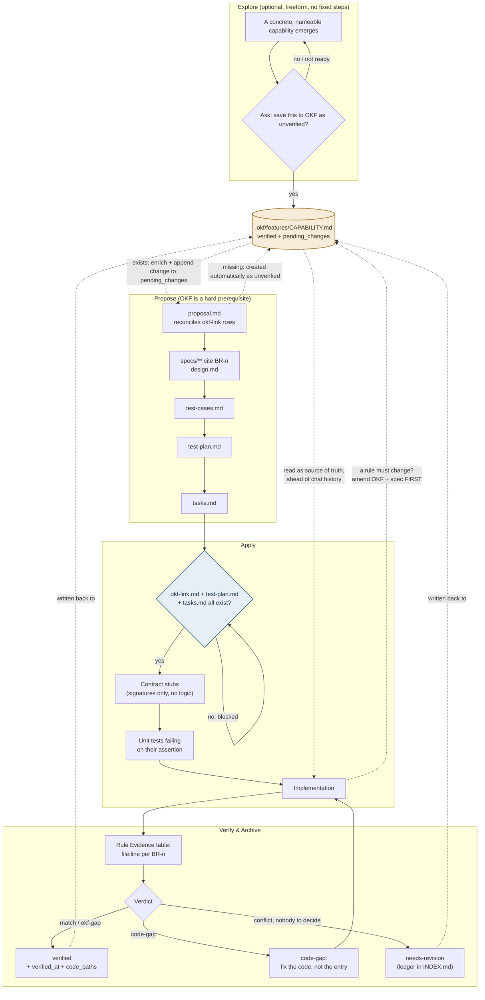
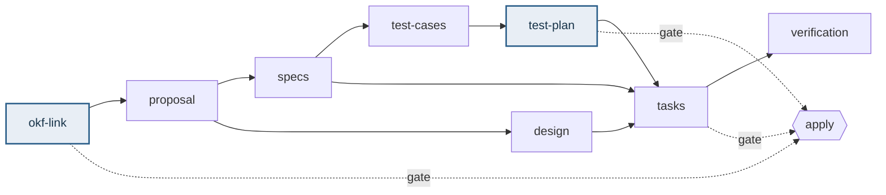

# OpenSpec + OKF Workflow

How change work (OpenSpec) and durable knowledge (OKF) stay in sync, using the
`okf-gated-feature` schema (`openspec/schemas/okf-gated-feature/schema.yaml`).

Two things are gates. Everything else stays as fluid as the underlying OpenSpec
skills already are - explore, propose, update, and revise in any order:

- An OKF entry (`.okf/features/<capability-name>.md`) must exist, even if only
  `unverified`, before implementation can start.
- A `test-plan.md` must exist before implementation can start.

## 1. What is actually enforced, and by whom

Be precise about this, because the difference matters.

The OpenSpec CLI enforces the gates by **file existence**. With
`apply.requires: [okf-link, test-plan, tasks]`, `openspec instructions apply`
reports `state: "blocked"` with `missingArtifacts` until all three files exist,
and `openspec status --json` marks them `done` once they do. That is a real
mechanical gate against forgetting a step, but it is **not** a content check: a
file containing one character satisfies it, and nothing verifies that
`okf-link.md` points at an entry that exists on disk.

Content is enforced separately, by `okf check` - a dependency-free Node
validator (`bin/okf.mjs`) that runs the same way for Claude, Codex, Cursor, a
developer at a terminal, and CI:

| Check | Level |
| --- | --- |
| `okf-link` rows resolve to entries that exist on disk | error |
| `okf-link` rows and the proposal's Capabilities section match exactly | error |
| Entry frontmatter complete, enums valid, `title` equal to the file name | error |
| `verified` without `verified_at` | error |
| `pending_changes` referencing an archived or nonexistent change | error |
| Duplicate `BR-n` id inside one entry | error |
| Unfilled `<placeholder>`, empty table row, empty list item | error |
| Test status outside `planned` / `skeleton` / `failing` / `passing` | error |
| A `BR-n` cited by the specs with no Rule Evidence row, or a row with no reference or an invalid verdict | error |
| `INDEX.md` out of sync with the entries; `needs-revision` missing from the ledger, or older than 30 days | error |
| `config.yaml` rule containing an unquoted `: ` (YAML reads it as a mapping and the CLI silently drops every rule for that artifact) | error |
| Missing `okf-kit` marker block, or `CLAUDE.md` and `AGENTS.md` blocks that differ from each other | error |
| Project running an older kit version than the one installed | warning |
| `verified` with empty `code_paths`; `failing` with no assertion message; template comment left in an entry | warning |

`okf check --archive <change-id>` adds the pre-archive set: the verification pass
must be recorded, `pending_changes` cleared, no entry left `unverified`, and no
`skeleton` test archived without an owner in Known Gaps.

The validator has its own fixture tests (`node test/run.mjs`), because a check
that silently stops firing is worse than no check.

What remains convention rather than enforcement is judgement: whether a business
rule is written *well*, whether the evidence someone cited actually proves the
rule, whether a stated reason is a real reason. Those are what `.okf/` diffs in
code review are for.

Mechanically, the OKF entries live outside the change directory, so the schema
tracks them through a pointer table (`okf-link.md`) inside the change - one row
per capability.

## 2. Lifecycle

OKF is touched at four points and never duplicated. `explore` only ever asks
before writing. `propose` treats an entry as mandatory - enriching what exists or
creating it the moment a change starts. `apply` reads the entries as the source
of truth and, when reality disagrees with a rule, amends the entry and the spec
*before* touching tests or code. `verify` is the only place `verified` moves.

## 3. Artifact dependency graph

`design` is required by `tasks` deliberately. It is not always *written*: when
none of its triggers apply, its whole content is one line,
`Not required because <specific reason>.` Removing it from `tasks.requires`
instead would mean `propose` never creates it at all, since propose only builds
until `apply.requires` is satisfied - so the changes that most need a design
would silently get none.

`okf-link` is created before `proposal` exists, so its capability list starts as
a best read of the request; the `proposal` step reconciles the two so the rows and
the Capabilities section match exactly.

## 4. Who enforces what

`openspec update` regenerates the `openspec-*` skill files under `.claude/`,
`.codex/`, and `.cursor/` from the CLI's bundled templates, so anything
hand-edited there is eventually overwritten. It does leave the `okf-kit` marker
block in `CLAUDE.md` / `AGENTS.md` alone.

That leaves three places where behavior can live: `openspec/config.yaml`, the
schema directory, and the marker block. All three are **kit-owned** - `okf
upgrade` replaces them, unless your project has edited the file, in which case it
reports the conflict and leaves it alone (see the README). Project-specific
instructions belong in `CLAUDE.md` / `AGENTS.md` *outside* the markers, which
upgrade never touches.

| Skill | Reads schema at runtime? | Where its OKF behavior lives |
| --- | --- | --- |
| `explore` | No | marker block in `CLAUDE.md` / `AGENTS.md` (asks before writing) |
| `propose` | Yes | `schema.yaml` (`okf-link` prerequisite, reconciliation) |
| `apply-change` | Yes (`apply.requires` + `apply.instruction`) | `schema.yaml` (gate, read entries, mid-apply amendment loop) |
| `verify-change` | Reads context files, not its own logic | marker block (OKF pass) + `verification` instruction |
| `archive-change` | Generic "incomplete artifact" warning only | marker block (run the OKF pass first) |
| `update-change` | Yes | `schema.yaml` (revises artifacts, keeps them coherent) |
| `sync-specs` | Yes | unchanged - specs only |

## 5. Entry state

| Field | Meaning |
| --- | --- |
| `verified: unverified` | From explore, or written while a change was proposed. Not checked against code. |
| `verified: verified` | Checked against implemented code with evidence, and accurate. |
| `verified: needs-revision` | Checked, and a real discrepancy remains that a human must settle. Accrues as debt in the `INDEX.md` ledger. |
| `pending_changes: [...]` | Change ids whose content nobody has checked yet. Non-empty means the entry is not fully trustworthy - even if `verified`. |
| `verified_at` | Date of the last successful verification pass. |
| `code_paths` | Globs where the feature actually lives, filled from verification evidence. |
| `criticality: high` | Auth, permissions, money, customer data. Verification needs fresh context or a human sign-off. |

`pending_changes` exists because the honest answer is often "most of this file is
verified, and this one change added something new". Downgrading the whole file on
every touch would make the label meaningless for a long-lived entry.

## 6. When OKF and the code disagree

| Verdict | Meaning | Action |
| --- | --- | --- |
| `match` | Code does what the rule says | Nothing |
| `okf-gap` | Entry missing or stale, code right, intent clear | Update the entry directly, show the diff |
| `code-gap` | Entry right, code wrong or incomplete | A defect. Fix the code. **Never** edit the entry to match |
| `conflict` | Genuine semantic disagreement, or a fix that changes domain meaning elsewhere | Ask a human. `needs-revision` only when nobody can decide |

The `code-gap` row is the one that keeps this workflow worth having. If every
disagreement were resolved by editing OKF, the knowledge base would always agree
with the code - including with every bug in it - and could never catch anything.

## 7. Test status vocabulary

| Status | Meaning |
| --- | --- |
| `planned` | A row in `test-plan.md` only; no test file yet |
| `skeleton` | File exists, declared with the runner's pending mechanism (`it.todo`, `test.fixme`). Compiles and lints clean because it has no body |
| `failing` | Executable, and failing on its **assertion** - not on a missing import or a type error. The real red state |
| `passing` | Green |

Unit tests for business rules must reach `failing` before their implementation
task starts. Contract stubs (signatures, a route returning 501, bodies that only
`throw`) are what makes that possible without lint and type noise - and a stub
containing logic defeats the whole point.

Integration and E2E tests may start as `skeleton` when their infrastructure is
not ready. Any row still at `skeleton` or `planned` at archive time must appear
in the test-plan Known Gaps with a reason and an owner.

## 8. Known limitations

Stated plainly rather than papered over:

- **The OpenSpec gates themselves still pass on an empty file.** `okf check`
  closes this, but only where it is actually run - a developer who never invokes
  it and never opens a PR can still start implementing behind three empty files.
  CI is the backstop, not the gate.
- **`okf check` cannot judge quality.** It confirms a `BR-n` has an evidence
  reference; it cannot confirm the reference proves the rule, or that a stated
  reason is a real reason. Read `.okf/` diffs in review.
- **Drift from work outside OpenSpec is not detected.** Hotfixes, refactors, and
  dependency bumps do not open a change, so they can move code out from under a
  `verified` entry silently. `code_paths` is recorded now specifically so a later
  audit can compare `git log` on those paths against `verified_at` - the audit
  itself does not exist yet.
- **Brownfield repos start empty.** Entries appear lazily, as changes touch each
  capability. There is no upfront backfill, on purpose: a mass-generated set of
  `unverified` entries nobody reads would look like coverage without being it.
- **`domains/` is deliberately absent.** Cross-feature domain knowledge is real,
  but promoting terms before there is evidence of reuse is guesswork. Revisit
  when the same term keeps appearing in three or more entries.

Full mechanics: `openspec/schemas/okf-gated-feature/schema.yaml`,
`openspec/config.yaml`, `.okf/README.md`, `CLAUDE.md` / `AGENTS.md`.
