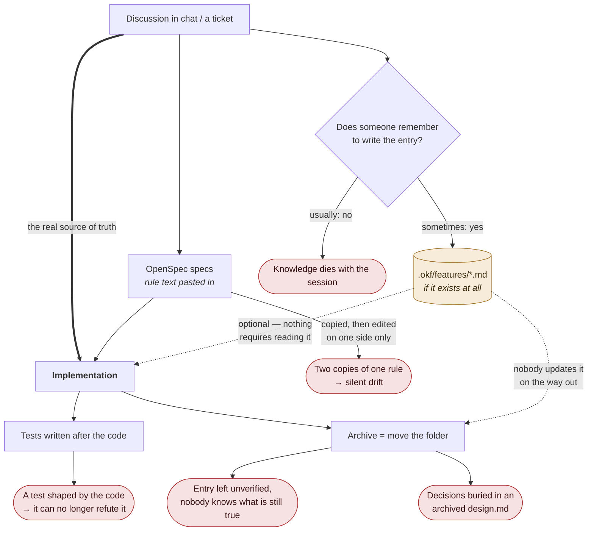
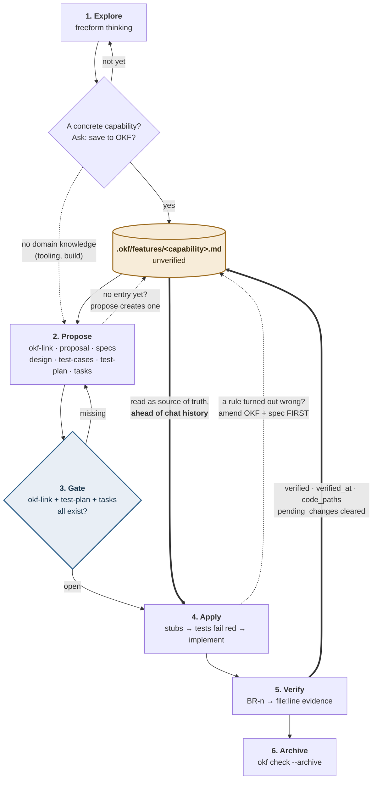
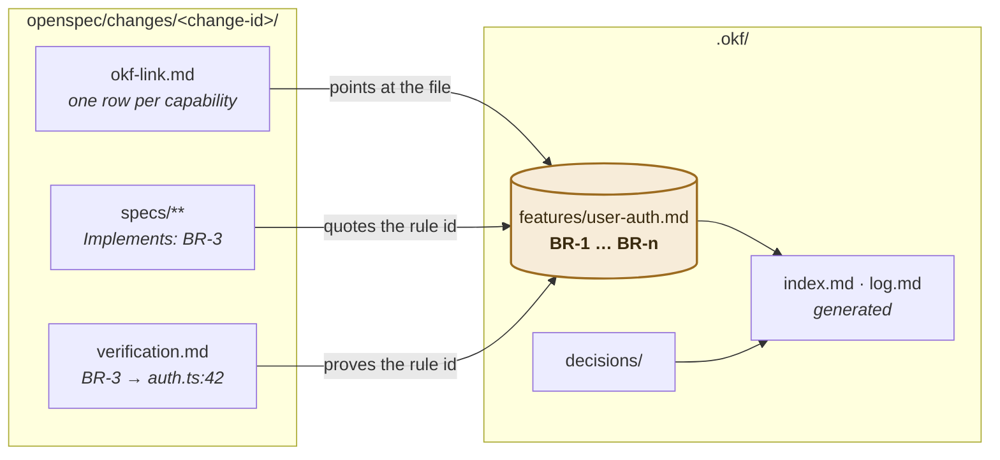
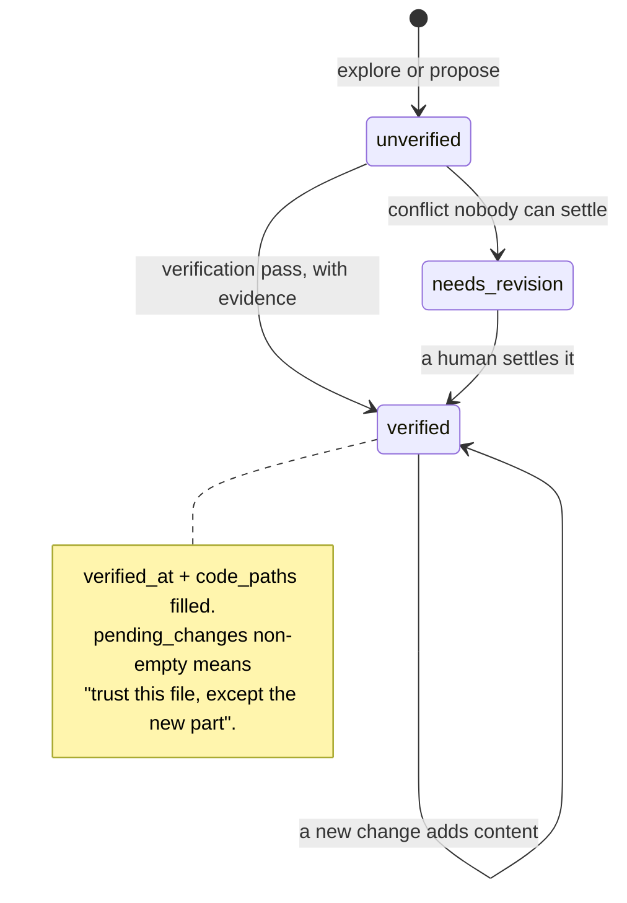
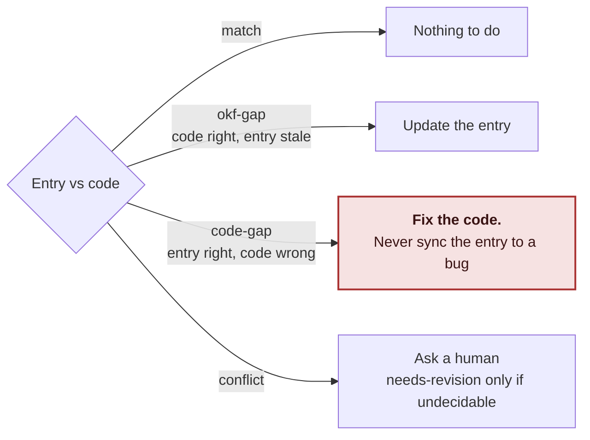

# Workflow at a Glance

How an OpenSpec change and an OKF knowledge entry move together, end to end.

This page is the map, not the manual. It shows *where* each file is written and
*what* the next step reads. For the mechanics — what `okf check` enforces, the
test vocabulary, the known limitations — read
[`openspec-okf-workflow.md`](./openspec-okf-workflow.md).

---

## The one idea

Two files, two lifetimes:

| | Lives in | Lifetime |
| --- | --- | --- |
| **A change** — proposal, specs, tasks | `openspec/changes/<change-id>/` | Ends at archive |
| **The knowledge** — terms, actors, `BR-n` rules | `.okf/features/<capability>.md` | Permanent, edited in place |

Everything below is one sentence repeated: **the change points at the knowledge,
it never copies it.** A rule is written once, gets a stable id (`BR-1`), and
specs, tests and evidence all quote that id.

---

## First, the problem: OpenSpec + OKF used free-form

Both tools work without the kit. Nothing stops a team from running OpenSpec and
keeping `.okf/` files by hand. What is missing is that **every arrow between
them is a habit, not a rule** — so the knowledge leaks out at each hand-off.



The failure is not that people are careless. It is that the free-form version
has **no step that fails** when a hand-off is skipped: the change still
proposes, the code still ships, the folder still archives. Missing knowledge is
invisible until months later, when nobody can say whether a rule in `.okf/` is
still true.

### What the kit turns each leak into

| Free-form leak | With okf-kit |
| --- | --- |
| Nobody creates the entry | `okf-link` is a prerequisite of propose; apply is **blocked** until it exists |
| Rule text copied into specs | One `BR-n` id space — specs cite the id, never the text |
| Implementation reads the chat | The schema tells apply to read the linked entries **ahead of chat history** |
| Tests written after the code | `test-plan` gate + a status vocabulary + a recorded falsifier per test |
| Archive with unverified knowledge | `okf check --archive` refuses to archive it |
| Decisions buried in `design.md` | Promoted into `.okf/decisions/`, and the promotion is checked |
| Knowledge silently going stale | `okf audit` compares `git log` on `code_paths` against `verified_at` |
| Custom instructions in skill files | Behavior lives in the schema + marker block, which survive `openspec update` |
| Each repo hand-copies the conventions | `okf init` / `okf upgrade` — one workflow, upgradable |

The rest of this page is the same six steps as above, with the dotted arrows
turned into required ones.

---

## The main flow



Read the thick arrows first — they are the whole point:

- **Into apply.** The implementer reads the OKF entry, not the chat transcript.
  Chat is lost on the next session; the entry is not.
- **Out of verify.** `verified` only ever moves in one place: the verification
  pass, and only with a `file:line` behind each rule.

---

## Step by step

| # | Step | Writes | Reads |
| --- | --- | --- | --- |
| 1 | **Explore** *(optional)* | Offers to create the entry as `unverified` — never silently | The conversation |
| 2 | **Propose** | `okf-link.md` (pointer table) + all change artifacts; enriches or creates the entry | **The OKF entry**, the request |
| 3 | **Gate** | — | Existence of `okf-link` + `test-plan` + `tasks` |
| 4 | **Apply** | Code and tests, test-first | **The OKF entry** and the specs |
| 5 | **Verify** | `verification.md` evidence; updates entry frontmatter; promotes decisions to `.okf/decisions/` | Code, entry, `design.md` |
| 6 | **Archive** | Moves the change to `archive/` | `okf check --archive` |

```bash
npx okf check                        # during and after propose / apply
npx okf index                        # after verify updates frontmatter
npx okf check --archive <change-id>  # before archive
npx okf audit                        # periodically: drift since verified_at
```

---

## Where the two sides are wired together

Only two threads connect a change to the knowledge base. Nothing else is copied.



- `okf-link.md` — the pointer table. Which capabilities does this change touch?
- `Implements: BR-n` — the specs quote rule ids, never the rule text.
- Rule Evidence — verification answers each cited `BR-n` with a real
  `file:line` or test name.

Naming keeps this from fragmenting: an entry is named after the **capability**,
never the change. `add-user-auth`, `fix-auth-mfa` and `improve-login` all edit
`user-auth.md`.

---

## The entry's life



An entry may stay `verified` while carrying a pending change — that is honest,
not a loophole. `needs-revision` is tracked as debt in `.okf/index.md`.

---

## When the entry and the code disagree

This is the table worth memorising.



If every disagreement were resolved by editing the entry, the knowledge base
would always agree with the code — including with every bug in it — and could
never catch anything.

**Order of repair when a rule turns out to be wrong:**

```text
OKF entry  →  spec  →  test-plan row  →  test  →  code
```

Reversing it lets the implementation define the domain.

---

## What is a hard gate, and what is not

| Enforced mechanically | Left to review |
| --- | --- |
| The three files exist before implementation (OpenSpec CLI) | Whether a rule is written *well* |
| Pointers resolve, no placeholders, ids unique, evidence present (`okf check`) | Whether the evidence actually proves the rule |
| Nothing archives `unverified` or with placeholders (`okf check --archive`) | Whether the record is honest |

The kit makes the record exist and be internally consistent. Reading `.okf/`
diffs in code review is what makes it true.

---

## Next

| You want | Read |
| --- | --- |
| Gates, artifact graph, test vocabulary, limitations | [`openspec-okf-workflow.md`](./openspec-okf-workflow.md) |
| What goes in an entry, frontmatter states | [`.okf/README.md`](../.okf/README.md) |
| Install / upgrade the kit | [`README.md`](../README.md) |
| Exact per-artifact instructions | `openspec/schemas/okf-gated-feature/schema.yaml` |
